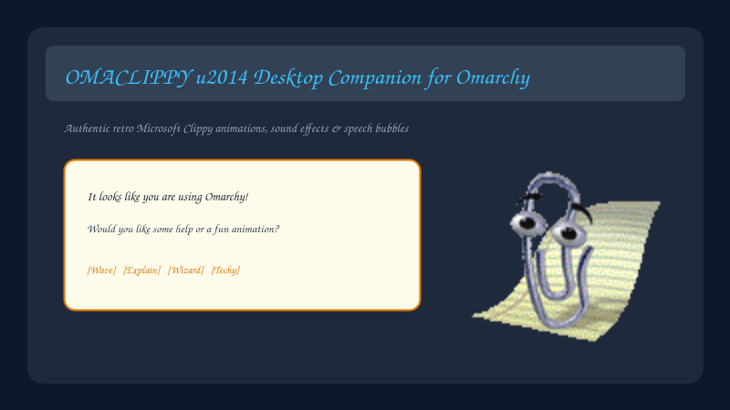

# Omaclippy 📎

> **The nostalgic Microsoft Clippy companion for Omarchy Linux & Hyprland.**



Omaclippy brings the iconic 1997 Microsoft Office Assistant back to life as a modern, interactive desktop companion integrated with the [Omarchy](https://omarchy.org/) desktop shell.

---

## ✨ Features

- 📎 **Authentic Sprite Animations:** Over 40 full animations parsed from the original Microsoft Agent Clippy sprite sheet (`Wave`, `Thinking`, `Explain`, `GetWizardy`, `GetArtsy`, `GetTechy`, `Writing`, `Print`, `Save`, `SendMail`, `Congratulate`, `IdleAtom`, `IdleRopePile`, `IdleFingerTap`, and many more).
- 🔊 **Sound Effects:** Complete collection of 15 classic sound effects synchronized with animations using `pw-play` (PipeWire).
- 💬 **Retro Speech Balloons:** Expressive speech bubble with typewriter animation, customizable durations, and built-in Omarchy tips and retro quotes.
- 🖱️ **Interactive Drag & Drop:** Click and drag Clippy anywhere across your multi-monitor desktop. 100% click-through mask ensures your underlying windows and desktop remain completely usable.
- 🎯 **Hyprland & Cursor Awareness:** Glances in the direction of your mouse pointer, reacts when windows move or when clicked nearby.
- 📊 **Status Bar Widget & Control Center:** Dedicated Omarchy Bar Widget with quick-actions, volume sliders, scale selectors, animation launcher grid, and speech prompt.
- ⚡ **Full IPC Surface:** Control Clippy directly from terminal scripts, hotkeys, or shell hooks via `omarchy-shell`.

---

## 🚀 Installation

### 1. Clone the plugin to your Omarchy plugins directory:

```bash
git clone https://github.com/jvlianodorneles/omaclippy.git ~/.config/omarchy/plugins/dorneles.omaclippy
```

### 2. Rescan or Restart the Omarchy Shell:

```bash
omarchy-shell shell rescanPlugins
# or
omarchy restart shell
```

### 3. Add to Status Bar (Recommended):

Add `{"id": "dorneles.omaclippy"}` to your `bar.layout` in `~/.config/omarchy/shell.json` or run:

```bash
omarchy bar move dorneles.omaclippy --section right
```

---

## 🗑️ Uninstallation

If you ever wish to remove Omaclippy:

### 1. Remove from Status Bar:

```bash
omarchy bar remove dorneles.omaclippy
```
*(Or remove `"dorneles.omaclippy"` from `bar.layout` in `~/.config/omarchy/shell.json`)*

### 2. Delete the plugin directory:

```bash
rm -rf ~/.config/omarchy/plugins/dorneles.omaclippy
```

### 3. Clean up saved state & configuration (Optional):

```bash
rm -rf ~/.local/state/omarchy/omaclippy
```

### 4. Reload Omarchy Shell:

```bash
omarchy-shell shell rescanPlugins
# or
omarchy restart shell
```

---

## 🎮 Desktop Interactions

| Action | Result |
|---|---|
| **Left Click on Clippy** | Plays a random fun animation + sound effect |
| **Click & Drag** | Moves Clippy anywhere across your screens |
| **Right Click on Clippy** | Shows a speech balloon with a random tip or quote |
| **Click Bar Widget** | Opens the rich Control Center & Animation Picker |
| **Right Click Bar Widget** | Instantly toggles Clippy On / Off |
| **Middle Click Bar Widget** | Triggers a quick random animation |

---

## 🤖 AI Agents & System Integration

Omaclippy transforms Clippy into an interactive visual companion for AI coding assistants (**Google Antigravity**, **Claude Code**, **Herdr**) and development workflows.

### 🧠 1. Model Context Protocol (MCP) Server (Antigravity & Claude)

Omaclippy includes a built-in MCP server (`mcp_server.py`) exposing tools for AI agents:
- `clippy_react(animation, message)`: Visual thought/action reaction + balloon.
- `clippy_speak(message)`: Typewriter speech balloon on screen.
- `clippy_animate(animation)`: Play authentic animation + retro sound.
- `clippy_status()`: Get live coordinates, mode, and visibility.

#### 🔧 Configure in Claude Code / Claude Desktop:

Add to your `~/.claude/mcp.json` or run:

```bash
claude mcp add omaclippy python3 ~/.config/omarchy/plugins/dorneles.omaclippy/mcp_server.py
```

#### 🔧 Configure in Antigravity / Gemini CLI:

Add to your MCP settings or plugin configuration:

```json
{
  "mcpServers": {
    "omaclippy": {
      "command": "python3",
      "args": ["/home/dorneles/.config/omarchy/plugins/dorneles.omaclippy/mcp_server.py"]
    }
  }
}
```

---

### 🐝 2. Herdr Autonomous Agents Integration

Omaclippy monitors [Herdr](https://github.com/fabean/herdr) agent states in real time:
- **Agent `working`:** Clippy plays `GetTechy` / `Writing` animation.
- **Agent `blocked` (needs user input):** Clippy plays `Alert` with retro warning sound and displays: *"⚠️ Agente 'worker-1' está bloqueado e aguarda sua resposta!"*.
- **Agent `done` (completed task):** Clippy plays `Congratulate` / `Wave` with celebration audio: *"🎉 Agente 'worker-1' concluiu sua tarefa com sucesso!"*.

*Toggle this feature on/off anytime in the Control Panel under Settings ➔ "AI Agents (Herdr)".*

---

### 💻 3. CLI Helper (`omaclippy`)

You can control Clippy directly from terminal commands or scripts:

```bash
# Quick agent status triggers
omaclippy thinking "Analisando dependências do projeto..."
omaclippy writing "Refatorando arquivos QML..."
omaclippy techy "Executando testes automatizados..."
omaclippy wizard "Executando migração de banco de dados..."
omaclippy alert "Erro encontrado nos testes!"
omaclippy done "Build finalizado com sucesso!"

# Speech & animations
omaclippy speak "Parece que você está codificando no Arch Linux!"
omaclippy play Congratulate
omaclippy tip
```

---

### 🪝 4. Git & Terminal Shell Hooks

Ready-to-use hooks are provided in the `hooks/` directory:

1. **Git Post-Commit Hook (`hooks/git-post-commit`):**
   - Plays the `Save` (floppy disk) animation and shows your commit message.
   - Copy to `.git/hooks/post-commit` or configure globally.

2. **Git Pre-Push Hook (`hooks/git-pre-push`):**
   - Plays the `SendMail` (paper airplane) animation when pushing code.
   - Copy to `.git/hooks/pre-push`.

3. **Zsh Long Command Timer (`hooks/zsh-command-hook.zsh`):**
   - Automatically notifies you via Clippy when long-running builds, downloads, or test suites (> 8s) finish or fail.
   - Add to your `~/.zshrc`:
     ```bash
     source ~/.config/omarchy/plugins/dorneles.omaclippy/hooks/zsh-command-hook.zsh
     ```

---

## 🛠️ CLI & IPC Commands

Control Clippy from any script, keybinding, or terminal:

```bash
# Play specific animations
omarchy-shell dorneles.omaclippy play Wave
omarchy-shell dorneles.omaclippy play Thinking
omarchy-shell dorneles.omaclippy play GetWizardy
omarchy-shell dorneles.omaclippy play GetTechy
omarchy-shell dorneles.omaclippy play Writing

# Make Clippy speak custom text in a balloon
omarchy-shell dorneles.omaclippy speak "Hello from the Arch Linux terminal!"

# Trigger a random tip
omarchy-shell dorneles.omaclippy tip

# Toggle Clippy on / off
omarchy-shell dorneles.omaclippy toggle
omarchy-shell dorneles.omaclippy on
omarchy-shell dorneles.omaclippy off

# Change size (small, normal, large, giant)
omarchy-shell dorneles.omaclippy setScale large

# Change mode (companion, roam, perch)
omarchy-shell dorneles.omaclippy setMode roam

# Reset position to default corner
omarchy-shell dorneles.omaclippy resetPosition

# Check status
omarchy-shell dorneles.omaclippy status
```

---

## 🎭 Animation Catalogue (43 Total)

- **Greetings & Gestures:** `Wave`, `Greeting`, `GoodBye`, `Explain`, `Thinking`, `Alert`, `Congratulate`, `GetAttention`, `GestureUp`, `GestureDown`, `GestureLeft`, `GestureRight`
- **Costumes & Actions:** `GetWizardy` (Merlin), `GetArtsy` (Painter), `GetTechy` (Computer), `Writing` (Notepad), `Print` (Printer), `Save` (Floppy), `SendMail` (Paper Airplane), `Searching`, `Processing`, `EmptyTrash`
- **Idles:** `RestPose`, `Idle1_1`, `IdleAtom`, `IdleEyeBrowRaise`, `IdleFingerTap`, `IdleHeadScratch`, `IdleRopePile`, `IdleSideToSide`, `IdleSnooze`
- **Directional Looks:** `LookLeft`, `LookRight`, `LookUp`, `LookDown`, `LookUpLeft`, `LookUpRight`, `LookDownLeft`, `LookDownRight`

---

## 📜 Acknowledgments & Credits

- Inspired by [modern-clippy](https://github.com/vchaindz/modern-clippy) by vchaindz.
- Original Microsoft Agent Clippy graphics & sound effects (Microsoft Office 1997-2003).
- Inspired by the classic [clippy.js](https://github.com/smore-inc/clippy.js).

---

## 📄 License

MIT License. See [LICENSE](LICENSE) for details.
